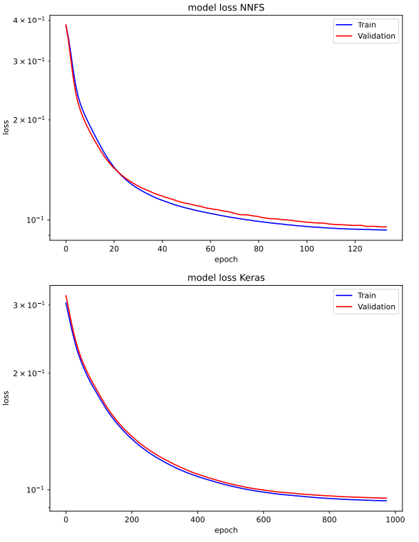
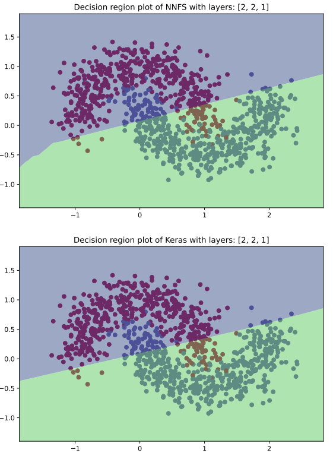
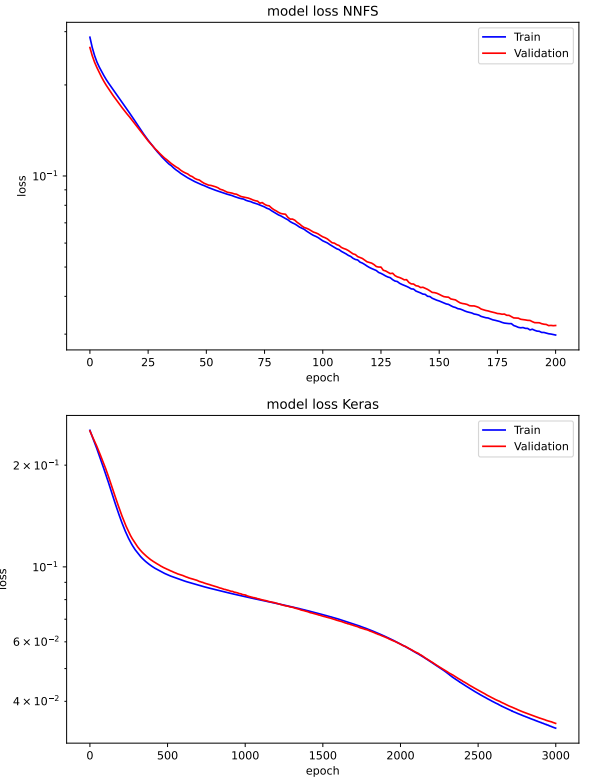
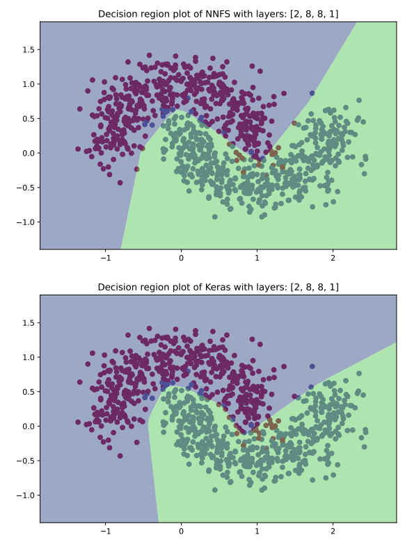
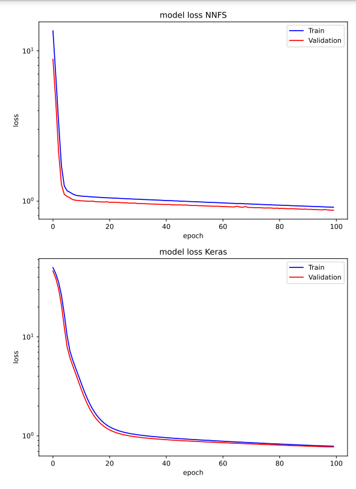
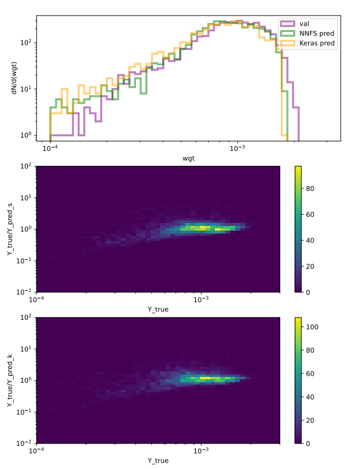

# NeuralNetworksFromScratch
Create a neural network from scratch and test it comparing the results with Keras results.


## Table of contents
- [About the project](#about-the-project)
    - [Forward propagation](#foraward-propagation)
    - [Bacward propagation](#backward-propagation)
- [Implementations](#implementations)
    - [Requirements](#requirements)
    - [Getting started](#getting-started)
    - [propagation method](#propagation-method)
    - [fit method](#fit-method)
    - [Example](#example)
- [TestNNHL](#testnnhl)
    - [Test 1](#test-1)
    - [Test 2](#test-2)
    - [Test 3](#test-3)


## About the project


The image above represents a sketch of a simple neural network composed by the input layer, one hidden layer and the output layer, divided by different colors. Each circle represents a node, that is a mathematical function which receive the inputs from the previous layer and produce and output. The output of a node depends only on the inputs provided to it and and the parameters of the node. 
The data flows from layer to layer until it reaches the output layer. At this point the loss function is computed respect the predicted output and its true value. The result describes error of the neural network in the prediction and it is used to update the parameters of the neural network.

### Forward propagation


The parameters of the neural networks are weights and biases. Each node has i weights and a bias, where i is the number of inputs (or nodes in the previous layer). In the forward propagation of a single node the weights are multiplied to the respective inputs and summed between them and the bias. Then the result is passed to the activation function which produces the result of the node.

```
inputs:
X = [x_0, x_1, .., x_i]     

weights:
W = [w_1, w_2, .., w_i]     

bias:
B = b     

pre-activation node:
Z = X*W + B = (x_0*w_0 + .. + x_i*w_i) + b     

output:
Y = activation(Z)    
```

This process is done for the nodes of the first hidden layer and then the output of that layer becomes the input of the next layer up to the output layer.


### Backward propagation
Once computed the loss function, the neural network uses the gradient descent process to correct the parameters and minimize the loss function. In particular, to each parameter is subracted a correction which depends on the derivative of the loss function respect that parameter and a constant, called learning rate. The only loss function available at the moment is the mean squared error.

```
learning rate:
l_r = 0.01

parameters correction obtaneid from gradient descent:
corr_b, corr_w

updated parameters:
b' = b - corr_b * l_r
w' = w - corr_w * l_r

loss function:
loss=loss(Y-Y_true)

regular gradient descent:
corr_b = d(loss)/d(b)
       = d(loss)/d(Y) * d(Y)/d(Z) * d(Z)/d(b)

where:
d(loss)/d(Y)   is the partial derivative of the loss function respect the output
d(Y)/d(Z)   is the partial derivative of the output respect the pre-activation node
d(Z)/d(b)   is the partial derivative of the pre-activation node respect the bias

corr_w_k = d(loss)/d(w_k)
       = d(loss)/d(Y) * d(Y)/d(Z) * d(Z)/d(w_k)

d(Z)/d(b) = 1
d(Z)/d(w_k) = x_k

=> corr_b = d(loss)/d(Y) * d(Y)/d(Z)
   corr_w_k = corr_b * x_k
```
The backward propagation is computed in opposite direction to the forward propagation. Starting from the output layer, the corrections are computed up to the first hidden layer.


## Implementations

### Requirements


### Getting started
To use the neural network import NNHL.py. To create a neural network create an object of the NeuralNetwork() class with an array containing the number of nodes for each layers (including the inputs) as argument. In the example is created a neural network with: 3 inputs, 2 hidden layers of 4 nodes each one and 1 output.

```
model = NeuralNetwork(layers=[3, 4, 4, 1])
```

Whit the definition of model also the following variables are defined:
- model.b is an array containing all the biases, they are initialized to 0
- model.w is an array containing all the weights, they are initialized with the heuristic weights inizialization
- model.n is an array containing all the values of the nodes of the last prediction
- model.activation is an array with 2 string, which defines respectively the activation funtions of the hidden layers and of the output layer. At the moment the available activation functions are: sigmoid, relu, linear.

To access the values of a given bias, weight or node the following methods are defined: model.bias(), model.weight(), model.node(). For bias and node methods, the arguments of these methods are the indices of the layer and the node. While for the weight metode, the arguments are the indices of the layer of the final node, the of the final node and of the initial node in the previous layer. For example:
```
model.node([0])   returns the values of the inputs
model.node([1, 0])   returns the value of the node of the first hidden layer
model.bias([1])   returns the values of the biases used to compute the first hidden layer
model.bias([1, 1])   returns the values of the bias used to compute the second node in the first hidden layer
model.weight([1])   returns a matrix with all the weights to compute the first hidden layer
model.weight([1, 0])   returns the values of the weights to compute the first node of the first hidden layer
model.weight([1, 0, 1])   returns the value of the weight that is multiplied to the second input to compute the first node of the first hidden layer
```


### propagation method
The propagation method is a method called inside the training and it computes the corrections to weights and biases. The corrections to a given layer depend on the corrections to the following layer. 

The following example shows the formulas for the corrections of the last 2 layers of a given neural network.
```
Example:
layers = [3, 4, 4, 1]
loss = mean squared error
activation = sigmoid

corr_b[3] = d(loss)/d(Y) * d(Y)/d(Z) 
               = [ 2 * (node[3] - Y_true) ] * [ node[3] * (1 - node[3]) ]
corr_w[3] = corr_b[3] * node[2]

corr_b[2] = d(loss)/d(bias[2]) =
            = d(loss)/d(node[3]) * d(node[3])/d(Z[3]) * d(Z[3])/d(node[2]) * d(node[2])/d(Z[2]) * d(Z[2])/d(bias[2])
            = ( corr_b[3] * weight[2] ) * [ node[2] * (1 - node[2]) ] 
corr_w([2]) = corr_b[2] * node[1]

...
```

### fit method
The fit method performs the training of the neural network. Its arguments are:
- X_train: the input training dataset
- Y_train: the true value of output training dataset
- X_val: the input validation dataset
- Y_val: the true value of output validation dataset
- epochs: the number of epochs of the training
- batch_size: the number of events of each batch. The weights and biases are updated at the end of each batch
- learn_rate 
- min_improvement: the minimum allowed difference between the validation loss of an epoch and the previous one
- patience: the maximum number of not allowed validation loss before the early stopping of the training
- shuffle: if True, the training dataset is shuffled at each epoch.


### Example 
Here there is an example of how to define a neural network with 4 inputs, 2 hidden layers of 16 nodes and 3 outputs. The activation functions are set to relu for the hidden layers and sigmoid for the output layer. The neural network is trained over the training and validation dataset, while the predictions are done over X events.
```
layers = [4, 16, 16, 3]
model = NNHL.NeuralNetwork(layers=layers, seed=7)
model.activation = ['relu', 'sigmoid']
model_s.fit(X_train=X_train, Y_train=Y_train, X_val=X_val, Y_val=Y_val, epochs=1000, batch_size=100, learn_rate=0.01, patience=10, min_improvement=0)
for i in range(len(X)):
    Y[i] = model.predict(X[i]) 
```


## TestNNHL
Here there are some tests to verify the correctness and the accuracy of the neural network built from scratch against Keras. 

To try the test i, set the value of test_i to True.


### Test 1
The first test is a simple test to check the correctness of the forward and backward propagation. The neural network of the neural networks from scratch (NNFS) and Keras have the same layers ([3, 2, 1]) and activation functions (sigmoid). Also the backward propagation formula with the regular gradient descent. In fact the Keras optimizer used in this test is SGD, instead of Adam.

Testing the events (X_train[[3]], Y_train[[3]]) the results are:
```
X_train[[3]] = [1, 1, 0],    Y_train[[3]] = 1
```


\
Testing the events (X_train[[6]], Y_train[[6]]) the results are:
```
X_train[[3]] = [0, 1, 0],    Y_train[[3]] = 1
```


\
### Test 2
The second test is a classification problem which uses the make_moons dataset of sklearn. 
In these examples, the activation functions used are: relu for the hidden layers and sigmoid for the output layer. Also here, the Keras optimizer used is SGD to have the regular gradient descent as in the case of the NNFS. The neural networks are trained with the generated dataset and then they predict over a grid on the plot to show the decision regions. 

In the first example, the layers used are: [2, 2, 1]



From the training plots, we can notice that the NNFS loss is smooth almost as the Keras loss but it decreases faster than the Keras loss. Moreover the training of the NNFS undergoes early stopping much earlier than Keras, even if they have the same patience and minimum improvement.
\



In this case the decision regions are almost the same for NNFS and Keras.

In the second example, the layers used are: [2, 8, 8, 1]



Also in this example, the NNFS training erarly stops much earlier than the Keras training.

\

\
The decision region for NNFS and Keras are very similar except for the low populated regions.


### Test 3
The third test is a regression problem. The neural network is trained to predict the weight of a 2 to 2 scattering event based on the momenta of the final particles. In particular, the initial particles are 2 protons with an energy of the center of mass equal to 13000 GeV. The produced particles are a pair of top - antitop particles. 

The dataset inside info_wgt_events.txt contains 16000 events, each one with 7 parameters which are respectively:
```
p_x(top), p_y(top), p_z(top), E(top), p_z(antitop), E(antitop), weight
```
The particles momenta are in the laboraoty frame  and the protons collide along the z axis. The last parameter (the weight) is the output.

The momenta of each events are used to compute the inputs of the neural networks. The inputs used in this example are 5 (although the number of degree of freedom of the event is 4, so one could use 4 inputs). 
```
Inputs:
1) the ratio between the energy of the center of mass of the interaction and the energy of the center of mass of the protons
2) the rapidity of the top in the laboratory frame 
3) the momenta along x of the top in the center of mass frame normalized by the energy of the center of mass of the interaction 
4) the momenta along y of the top in the center of mass frame normalized by the energy of the center of mass of the interaction 
5) the momenta along z of the top in the center of mass frame normalized by the energy of the center of mass of the interaction 
```
In this way the inputs are normalized between 0 and 1. The outputs are the absolute value of the logaritm of the weights. The reason is that the weights are of the order of 0.001 and it is easier for the neural network to predict larger values than values close to 0. The layers structure is [2, 64, 64, 1] and the activation functions are relu for the hidden layers and linear for the output layer. In this example Keras optimizer is Adam. The epochs are set at 100 for both neural networks The NNFS has a smaller batch size than Keras because, during the testing, the NNFS training was quite sensible to batch size. 

As we can see, the training plots are similar for NNFS and Keras.


\
In the first histogram, we can see that the predictions are in agreement for both NNFS and Keras with the true outputs. Moreover the the predictions are very similar between them, except for some statistical fluctuations. The second histogram represents the distribution of the ratio between true values and the NNFS predictions respect the true values. It shows that NNFS has a good accuracy (highly populated for Y_true/Y_pred_NNFS about 1) in correspondence of the peak of Y_true and it has a lower accuracy for events with lower probability, like events with small weights. The third histogram represents the same distributions respect the Keras predictions and it is very similar to the NNFS prediction.



\


## Considerations
The NNFS has good results, which are similar to the results of Keras. However, the training of NNFS is mumch more longer than the Keras one and it is much more sensible overtraining. Moreover sometimes it has problems with the batch size tuning. 

Additional methods can be implemented to resolve different problems, like to implement convolutional neural network, or additional loss functions and activation functions.


