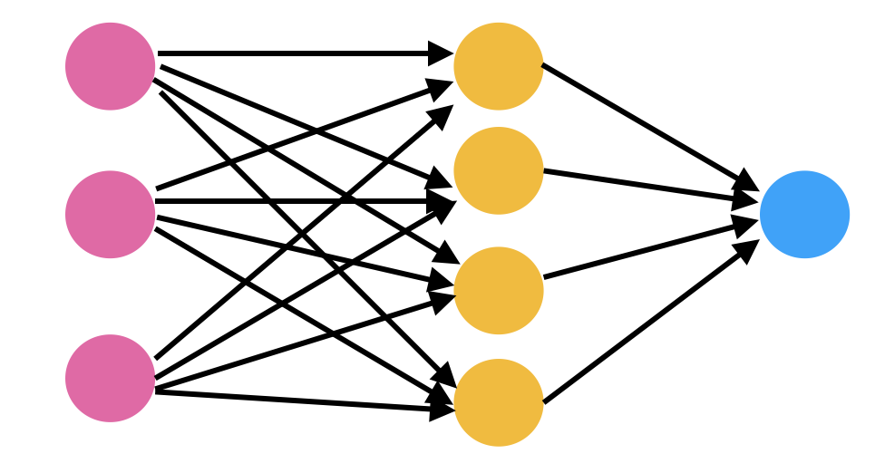

# NeuralNetworksFromScratch
Create a neural network from scratch and test it comparing the results with Keras results.


## Table of contents
- [About the project](#about-the-project)
    - [Forward propagation](#foraward-propagation)
    - [Bacward propagation](#backward-propagation)
- [Implementations](#implementations)
    - [Installation](#installation)
    - [Getting started](#getting-started)
    - [fit method](#fit-method)
    - [Example](#example)
- [TestNNHL](#testnnhl)
    - [Test 1](#test-1)
    - [Test 2](#test-2)
    - [Test 3](#test-3)
- [Considerations](#considerations)


## About the project



The image above represents a sketch of a simple neural network composed by the input layer, one hidden layer and the output layer, divided by different colors. Each circle represents a node, that is a mathematical function which receive the inputs from the previous layer and produce and output. The output of a node depends only on the inputs provided to it and and the parameters of the node. The data flows from layer to layer until it reaches the output layer. During the training of the neural network, the error of the predictions is measured through the loss function and its derivative is used to improve the parameters of the neural network.


### Forward propagation


The parameters of the neural networks are weights and biases. Each node has i weights and one bias, where i is the number of inputs (or nodes in the previous layer). In the forward propagation of a single node the weights are multiplied to the respective inputs and summed between them and the bias. Then the result is passed to the activation function which produces the result of the node.

```
inputs:
X = [x_0, x_1, .., x_i]     

weights:
W = [w_1, w_2, .., w_i]     

bias:
B = b     

pre-activation node:
Z = X*W + B = (x_0*w_0 + .. + x_i*w_i) + b     

output:
Y = activation(Z)    
```

This process is done for the nodes of the first hidden layer and then the output of that layer becomes the input of the next layer, up to the final layer.


### Backward propagation
After the foward propagation and the generation of the ouputs, the loss function is computed respect the predicted outputs and their true value. Then, the neural network uses the gradient descent process to correct the parameters and minimize the loss function. In particular, to each parameter is subracted a correction which depends on the derivative of the loss function respect that parameter and a constant, called learning rate. The only loss function available at the moment is the mean squared error.

```
learning rate:
l_r = 0.01

parameters correction obtaneid from gradient descent:
corr_b, corr_w

updated parameters:
b' = b - corr_b * l_r
w' = w - corr_w * l_r

loss function:
loss=loss(Y-Y_true)

regular gradient descent:
corr_b = d(loss)/d(b)
       = d(loss)/d(Y) * d(Y)/d(Z) * d(Z)/d(b)

where:
d(loss)/d(Y)   is the partial derivative of the loss function respect the output
d(Y)/d(Z)      is the partial derivative of the output respect the pre-activation node
d(Z)/d(b)      is the partial derivative of the pre-activation node respect the bias

corr_w_k = d(loss)/d(w_k)
       = d(loss)/d(Y) * d(Y)/d(Z) * d(Z)/d(w_k)

d(Z)/d(b) = 1
d(Z)/d(w_k) = x_k

=> corr_b = d(loss)/d(Y) * d(Y)/d(Z)
   corr_w_k = corr_b * x_k
```
The backward propagation is computed in opposite direction to the forward propagation. Starting from the output layer, the corrections are computed up to the first hidden layer. The corrections to a given layer depend on the corrections to the following layer. 


The following part will focus on error popagation in case of hidden layers with an example, but it is not necessary to use the neural network. To continue reading about the neural network go to the following section. 
The example bellow shows the formula for the corrections of the last 2 layers of a given neural network.
```
Example:
layers = [3, 4, 4, 1]
loss = mean squared error
activation = sigmoid

corrections to the bias of the node i of output layer:
corr_b[3, i] = d(loss)/d(Y[i]) * d(Y[i])/d(Z[i]) * d(Z[i])/d(b[3, i])
1)  d(loss)/d(Y[i]) = 2 * (node[3, i] - Y_true[i])
2)  d(Y[i])/d(Z[3, i]) = node[3, i] * (1 - node[3, i])
3)  d(Z[3, i])/d(b[3, i]) = 1
=> corr_b[3, i] = [ 2 * (node[3, i] - Y_true[i]) ] * [ node[3, i] * (1 - node[3, i]) ]

corrections to the weight of the node i of output layer respect the node j of the previous layer:
corr_w[3, i, j] = d(loss)/d(Y[i]) * d(Y[i])/d(Z[i]) * d(Z[i])/d(w[3, i, j])
3)  d(Z[3, i])/d(w[3, i, j]) = node[2, j]
=> corr_w[3, i, j] = corr_b[3, i] * node[2, j]

corrections to the output layer parameters:
=> corr_b[3] = [ 2 * (node[3] - Y_true) ] * [ node[3] * (1 - node[3]) ]
   corr_w[3] = corr_b[3] @ node[2]     (@: outer product between vectors)


corrections to the second layer parameters:
corr_b[2] = d(loss)/d(bias[2]) =
            = d(loss)/d(node[3]) * d(node[3])/d(Z[3]) * d(Z[3])/d(node[2]) * d(node[2])/d(Z[2]) * d(Z[2])/d(bias[2])
            = ( corr_b[3] * weight[2] ) * [ node[2] * (1 - node[2]) ] 

=> corr_b[2] = ( corr_b[3] * weight[2] ) * [ node[2] * (1 - node[2]) ]
   corr_w[2] = corr_b[2] @ node[1]

...
```


## Implementations

### Installation
```
$ git clone https://github.com/lucabeccatini/NeuralNetworksFromScratch.git
$ cd NeuralNetworksFromScratch
$ sudo pip3 install -r requirements.txt
```


### Getting started
To use the neural network import NNHL.py. To create a neural network create an object of the NeuralNetwork() class with an array containing the number of nodes for each layers (including the inputs) as argument. In the example is created a neural network with: 3 inputs, 2 hidden layers of 4 nodes each one and 1 output.

```
model = NeuralNetwork(layers=[3, 4, 4, 1])
```

With the definition of model also the following attributes are defined:
- model.b is an array containing all the biases, they are initialized to 0
- model.w is an array containing all the weights, they are initialized with the heuristic weights inizialization
- model.n is an array containing all the values of the nodes of the last prediction
- model.activation is an array with 2 string, which defines respectively the activation funtions of the hidden layers and of the output layer. At the moment the available activation functions are: sigmoid, relu, linear.

To access the values of a given bias, weight or node the following methods are defined: model.bias(), model.weight(), model.node(). For bias and node methods, the arguments of these methods are the indices of the layer and the node. While for the weight metode, the arguments are the indices of the layer of the final node, the of the final node and of the initial node in the previous layer. For example:
```
model.node([0])   returns the values of the inputs
model.node([1, 0])   returns the value of the node of the first hidden layer
model.bias([1])   returns the values of the biases used to compute the first hidden layer
model.bias([1, 1])   returns the values of the bias used to compute the second node in the first hidden layer
model.weight([1])   returns a matrix with all the weights to compute the first hidden layer
model.weight([1, 0])   returns the values of the weights to compute the first node of the first hidden layer
model.weight([1, 0, 1])   returns the value of the weight that is multiplied to the second input to compute the first node of the first hidden layer
```


### fit method
The fit method performs the training of the neural network. Its arguments are:
- X_train: the input training dataset
- Y_train: the true value of output training dataset
- X_val: the input validation dataset
- Y_val: the true value of output validation dataset
- epochs: the number of epochs of the training
- batch_size: the number of events of each batch. The weights and biases are updated at the end of each batch
- learn_rate: learning rate
- min_improvement: the minimum allowed difference between the validation loss of an epoch and the previous one
- patience: the maximum number of not allowed validation loss before the early stopping of the training
- shuffle: if True, the training dataset is shuffled at each epoch.


### Example 
Here there is an example of how to define a neural network with 4 inputs, 2 hidden layers of 16 nodes and 3 outputs. The activation functions are set to relu for the hidden layers and sigmoid for the output layer. The neural network is trained over the training and validation dataset, while the predictions are done over X events.
```
layers = [4, 16, 16, 3]
model = NNHL.NeuralNetwork(layers=layers, seed=7)
model.activation = ['relu', 'sigmoid']
model_s.fit(X_train=X_train, Y_train=Y_train, X_val=X_val, Y_val=Y_val, epochs=1000, batch_size=100, learn_rate=0.01, patience=10, min_improvement=0)
for i in range(len(X)):
    Y[i] = model.predict(X[i]) 
```


## TestNNHL
Here there are some tests to verify the correctness and the accuracy of the neural network built from scratch against Keras. 

To try the test i, set the value of test_i to True.


### Test 1
The first test is a simple test to check the correctness of the forward and backward propagation. The neural network of the neural networks from scratch (NNFS) and Keras have the same layers ([3, 2, 1]) and activation functions (sigmoid). Also the backward propagation formula with the regular gradient descent. In fact the Keras optimizer used in this test is SGD, instead of Adam.

Testing the events (X_train[[3]], Y_train[[3]]) the results are:
```
X_train[[3]] = [1, 1, 0],    Y_train[[3]] = 1
```


\
Testing the events (X_train[[6]], Y_train[[6]]) the results are:
```
X_train[[3]] = [0, 1, 0],    Y_train[[3]] = 1
```


### Test 2
The second test is a classification problem which uses the make_moons dataset of sklearn. 
In these examples, the activation functions used are: relu for the hidden layers and sigmoid for the output layer. The neural networks are trained with the training and validation datasets and they are tested against a test dataset, that is represented in the plots with the accuracy of the test in the legend. Moreover, the neural networks predict over a grid on the plot to show the decision regions. The first 4 plots are obtained from neural networks with 1 hidden layer


\


The following 3 plots are obtained from neural networks with 2 hidden layers


\


We can notice that the better result with 1 hidden layer is for the configuration [2, 4, 1] which separetes very well the two moons, due to the shape of its decision region. While for 2 hidden layers the results are almost the same, except for the slightly lower accuracy for the last test, which seems to suggest a larger overtraining than the other tests.

Now, to check the correctness, we can compare the results of NNFS with the results of Keras. We expect almost the same results, except for some differences due to statistical fluctuations (they have different seed of weight initialization) and due to the optimizer SGD of Keras. 


\


From the training plots, we can notice that the NNFS loss is smooth almost as the Keras loss but it decreases faster than the Keras loss. Moreover the training of the NNFS undergoes early stopping much earlier than Keras, even if they have the same patience and minimum improvement. From the plots of the decision regions we can notice that in the case of 1 hidden layers, the results of keras have less accuracy, while fort 2 hidden layers they are almost the same.


### Test 3
The third test is a regression problem. The neural network is trained to predict the weight of a 2 to 2 scattering event based on the momenta of the final particles. In particular, the initial particles are 2 protons with an energy of the center of mass equal to 13000 GeV. The produced particles are a pair of top - antitop particles. 

The dataset inside info_wgt_events.txt contains 16000 events, each one with 7 parameters which are respectively:
```
p_x(top), p_y(top), p_z(top), E(top), p_z(antitop), E(antitop), weight
```
The particles momenta are in the laboraoty frame  and the protons collide along the z axis. The last parameter (the weight) is the output.

The momenta of each events are used to compute the inputs of the neural networks. The inputs used in this example are 5 (although the number of degree of freedom of the event is 4, so one could use 4 inputs). 
```
Inputs:
1) the ratio between the energy of the center of mass of the interaction and the energy of the center of mass of the protons
2) the rapidity of the top in the laboratory frame 
3) the momenta along x of the top in the center of mass frame normalized by the energy of the center of mass of the interaction 
4) the momenta along y of the top in the center of mass frame normalized by the energy of the center of mass of the interaction 
5) the momenta along z of the top in the center of mass frame normalized by the energy of the center of mass of the interaction 
```
In this way the inputs are normalized between 0 and 1. The outputs are the absolute value of the logaritm of the weights. The reason is that the weights are of the order of 0.001 and it is easier for the neural network to predict larger values than values close to 0. The activation functions are relu for the hidden layers and linear for the output layer. The epochs are set at 100 to avoid long training time, due to the slowness of NNFS with a large number of parameters. The predictions are performed over the same test dataset for all the neural networks. The first 3 images are obtained with 2 hidden layers and the following 3 images with 3 hidden layers


\


\


\
Firstly, we can notice that the training plots are almost the same between the tests. The histogram represents the distribution of the true and predicted weights, which are the predicted outputs after the ritransofrmation. The predictions are quite simlar to the true distribution, with some disagreement for the tails and for the largest values, where there is a drop. The 2d histogram represents the distribution of the ratio between true values and the predictions respect the true values. In the best scenario, we would expect a flattened horizontal line highly populated. From the plots we can say that the neural networks with the best results are those with 64 nodes in the hidden layers, with small differences between the one with 2 hidden layers and the one with 3 hidden layers. 

To check the correctness of the NNFS distribution, we can compare them with the distribution of Keras using the same settings, except that in this case we used the Adam optimizer.


\


We can see that the Keras predictions have similar results to the NNFS predictions and both predictions are in agreement.


## Considerations
Respect the 2 tests that we have done, the NNFS has good results, even compared to the results of Keras. However, the training of NNFS is much more slower than the Keras one and it is much more sensible overtraining. Moreover, sometimes the NNFS neural network have problems with the batch size tuning. 

Additional methods can be implemented to resolve different problems, like to implement convolutional neural network, or additional loss functions and activation functions.


